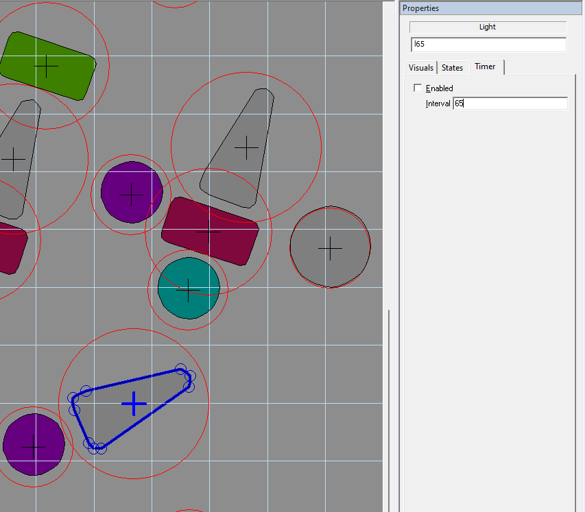
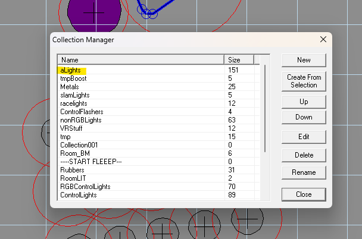

# VPX Light Controller

A class to help vpx original table authors manage light states and custom sequences. Supports managing multiple light states per light, RGB lights, Syncing with VPX light sequences, custom key frame light sequences, import / export of light sequences to show creator and several utility functions for interacting with lights.

# Installing

- Download the latest release from github releases and copy the vbs code from **lightController.vbs** into your vpx table script.

# Registering Lights <a id="registerLights1"></a>

#### vpmMapLights - what is it?

-vpmMapLights is a function which is available from the core.vbs script that comes with VPX. It allows you to setup your lights by specifying a light index in the lights timer interval property. This means you could have multiple light objects assigned to the same index to generate a greater light influence, or you might want to tie multiple lights together so they flash at the same time. This technique is used in vpx rom based tables to map the lights to the rom index. We use the same setup here for consistency.

 - The first thing you need to do is assign a number to each light or
   light groups and put that in the light objects timer interval



 - Next you need to add all of your lights into a vpx collection called ***aLights***
 


 - At the top of your table script, make sure these variables are defined:
 ```
Const cGameName = "REPLACE WITH TABLE NAME"
Dim tablewidth: tablewidth = Table1.width
Dim tableheight: tableheight = Table1.height
```

 - In your table init sub, you can call the light controller's register lights function
```
lightCtrl.RegisterLights
```
This will do a few things. First, it will call vpmMapLights to setup your light indexes. Next it will build a grid containing all of your light positions, this is used if you want to export your lights and also for some custom color fading routines. Second, it will try to find any lightmaps that might be assoiciated with your lights. (these are primitives you can setup that need to track the opacity and color of your lights). Finally it will create a ***Sequence Runner*** for each light, this allows for each light to have multiple states, e.g. a mode shot and a multiball jackpot shot. More on Sequence Runners below.

 - Finally you need to call ```lightCtrl.Update()``` inside a timer. You can reuse an existing timer or setup a new one. A 16ms timer works well


# Light Controller Features
  
  - Managing Lights
    - Light On/Off
    - Light Blink
    - Light Color
    - Light Level
    - Light Utilities
        - Light On With Color
        - Light On With Flicker
        - Light Pulse
        - Light Pulse With Profile
  - Managing Shots
    - Add Shot
    - Remove Shot
    - Remove All Shots
    - Is Shot Lit
  - Syncing With VPX Lights
  - Light Sequences
    - VPX Sequences
    - Custom Sequences
    - MPF Show Creator
      - Exporting Lights
      - Importing Light Shows

# Managing Lights <a id="managingLights"></a>

To control your lights you can call the following functions on the light controller object. All these require you to pass the vpx light as a parameter. E.g. The below examples assume you have a light in vpx called L01

## Light On/Off/Blink <a id="lightOn"></a>

To turn a light on you use: **LightOn** and **LightOff**. To  set a light on a repeating Blink, you can use **Blink**
```
lightCtrl.LightOn L01
lightCtrl.LightOff L01
lightCtrl.Blink L01
```


## Light Color <a id="lightColor"></a>

VPX lights have color and fullColor properties. To change the light color use: **LightColor**

```
lightCtrl.LightColor L01, RGB(255,0,0) 'Sets the color property to Red

lightCtrl.LightColor L01, Array(RGB(255,0,0), Null) 'Sets the color to Red

lightCtrl.LightColor L01, Array(RGB(255,0,0), RGB(0,255,0)) 'Sets the color and fullColor propteries to Red & Green

lightCtrl.LightColor L01, Array(Null, RGB(0,0,255)) 'Sets the fullColor to Blue
```


## Light Level <a id="lightLevel"></a>

All of the lights registerd with the controller will be set to modulate brightness between 0-100. To change the level use: **LightLevel**

```
lightCtrl.LightLevel L01, 50 'Set the lights maximum brightness to 50%

lightCtrl.LightLevel L01, 100 'Set the lights maximum brightness to 100%
```


## Light Utilities <a id="lightUtilities"></a>

To help control common light events there are some utility functions available:

### Light On With Color <a id="lightOnWithColor"></a>

Turns a light whilst also setting the color

```
lightCtrl.OnWithColor L01, RGB(255,0,0)
```
## Fade Light To Color

Changes the color of a light to a new color, with a fading effect over a specified duration. 

```lightCtrl.FadeLightToColor L01, RGB(255,0,0), 180```

### Light On With Flicker <a id="lightFlicker"></a>

Turns a light on with a short flickering sequence

```
lightCtrl.OnWithFlicker L01
```


### Light Pulse <a id="pulse"></a>

Pulses a light with the default pulse sequence. The state of the light does not change. E.g. after the pulse has finished, if the light was previously on, it will be on again.

The second parameter is the number of times to repeat the pulse.

```
lightCtrl.Pulse L01, 0 'Pulse the light once, no repeat (total 1 pulse)

lightCtrl.Pulse L01, 1 'Pulse the light, repeat the pulse once (total 2 pulses)
```


### Light Pulse With Profile <a id="pulseWithProfile"></a>

Pulses a light with a custom pulse sequence. The state of the light does not change. E.g. after the pulse has finished, if the light was previously on, it will be on again.

The second parameter is the pulse sequence to use. Each element in the array is the brightness of the light for that frame. Each frame is 20ms so the 5 element seq below would last 100ms.

```
lightCtrl.PulseWithProfile L01, Array(10,50,100,50,0), 0
``` 

### Light Pulse With Color<a id="pulseWithColor"></a>

Pulses a light with a color. The state of the light does not change. E.g. after the pulse has finished, if the light was previously on, it will be on again and the color will reset.

```
lightCtrl.PulseWithColor L01, RGB(255,0,0), 0
```

# Managing Shots <a id="managingShots"></a>

Aside from turning lights on and making them blink, you can add dfferent sequences to lights which run one after the other. You can manually manage this by creating sequence runners and adding / removing sequences. For convience the most common senarnio is to have one light lit for lots of differnt reasons. You may have a light lit for a mode shot but also for a jackpot or combo. The light controller lets you add multiple "Shots" to a light.

## Add Shot <a id="addShot"></a>

To add a new shot to a light use: **AddShot**

```
lightCtrl.AddShot "Name", L01, RGB(255,0,0)
```

The first parameter is a name for the shot so we can reference it later.
The second parameter is the vpx light object
The third parameter is the color you want this shot to be.


## Remove Shot <a id="removeShot"></a>

To remove a shot from a light use: **RemoveShot**

```
lightCtrl.RemoveShot "Name"
```

Call remove shot with the name of the shot you want to remove

## Remove All Shots <a id="removeAllShots"></a>

To remove all shots from a light use: **RemoveAllShots**

```
lightCtrl.RemoveAllShots L01
```

Call remove all shots with the vpx light object

## Is Shot Lit <a id="isShotLit"></a>

To check if a shot is current active on the light use: **IsShotLit**

```
lightCtrl.IsShotLit "Name", L01
```

The first parameter is the name of the shot
The second parameter is the vpx light object
	
# Light Sequences <a id="lightSequences"></a>

## VPX Sequences <a id="vpxSequences"></a>

The light controller can sync your lights to VPX light sequences

In the example below you start the vpx sequence **SeqCircleOutOn**. Then call the light controller **SyncWithVpxLights** function with the collection the vpx light sequence uses. This will start syncing your lights.

```
SomeVPXLightSeq.Play SeqCircleOutOn,50,100
lightCtrl.SyncWithVpxLights SomeVPXLightSeq

'Stop syncing with vpx lights once the sequence is complete
Sub SomeVPXLightSeq_PlayDone()
	lightCtrl.StopSyncWithVpxLights()
End Sub
```

By default this will use the current color of the light. If you want to override the color of all the lights during the sequence you can use **SetVpxSyncLightColor**

```
SomeVPXLightSeq.Play SeqCircleOutOn,50,100
lightCtrl.SyncWithVpxLights VpxCollection
lightCtrl.SetVpxSyncLightColor RGB(255,0,0)
```

## Custom Sequences <a id="customSequences"></a>

The controller supports writing your own custom sequences using a **SequenceRunner** and **LightSequence** items. Each Sequence Runner added to the controller is ran concurrently with other sequence runners. Each Light Sequence added to a runner is ran one after the other (following).

Lets say you have a set of 3 lights and you want to light one after the other on repeat.


The sequence might this:

 - First frame: 
   - Light 1 On
 - Second frame:
   - Light 1 Off
   - Light 2 On
 - Third Frame:
   - Light 2 Off
   - Light 3 Off
 - Fourth Frame: 
   - Light 3 Off

Using the controller you can create a sequence runner for this using **CreateSeqRunner**

```
lightCtrl.CreateSeqRunner "_RunnerName_" 'Runner name can be anything you want
```

Then you need to create the actual sequence using the **LCSeq** class.

```
Dim lSeqTest: Set lSeqTest = new LCSeq
lSeqTest.Name = "lSeqTest"

lSeqTest.Sequence = Array( _
                    Array("L01|100"), _
                    Array("L01|0", "L02|100"), _
                    Array("L02|0", "L03|100"), _
                    Array("L03|0"))

lSeqTest.UpdateInterval = 180
lSeqTest.Color = Null
lSeqTest.Repeat = True

```

Finally, when you want to run the sequence, you need to add it to the runner you created using **AddLightSeq**.

```
lightCtrl.AddLightSeq "_RunnerName_", lSeqTest
```

As the above example is set to repeat, you can stop it by using **RemoveLightSeq**

```
lightCtrl.RemoveLightSeq "_RunnerName_", lSeqTest
```

## Color Palettes

When runnning light sequences it's nice to be able to change the color of the sequence. In addition to the color and sync color properties, the Light Controller supports palettes of color (gradients). 

To create a palette there are two options. You can create a palette between a start and end color, this will be a gradient from start to finish. Or you can create a palette with multiple color stops. 

To create a simple start and end palette you use:

```'
Dim palette
palette = lightCtrl.CreateColorPalette("FF0000", "0000FF")
```


The colors are defined with a hex value (above, red -> blue).

To create a palette with stops you can use:

```lightCtrl.CreateColorPaletteWithStops("FF0000", "0000FF", Array(127), Array("00FF00"))```


Here we need to pass in the start and end colors with an array of stop posistions and an array of stop colors for those positions. Note the palette is 255 colors, so the above creates a green stop at position 127 (50%).

#### How palette are applied to sequences

You can use palettes with either any custom sequence or when syncing lights with vpx sequences.

 - Palette with VPX Seq
	 - ```lightCtrl.SetVpxSyncLightsPalette paletteWithStops, "north", 0```
			 - param1: the palette
			 - param2: direction
			 - param3: speed
	 - The direction param determines how the palette is applied to the lights. The options available are:
			 - TopToBottom
			 - BottomToTop
			 - LeftToRight
			 - RightToLeft
			 - RadialOut
			 - RadialIn
			 - Clockwise
			 - AntiClockwise
	 - The speed param allows you to shift the colors in the palette over time. 
			 - A value of 0 or Null wont shift the colors at all during the sequence
			 - Any other value e.g. 120 will shift the colors by 1 every 120ms.

# Show Creator <a id="showCreator"></a>

For more complex light sequences the controller supports exporting your table lights so that they can be imported a tool called **showcreator**

https://github.com/missionpinball/showcreator


Show Creator is a tool for creating lightshows in MPF (Mission Pinball Framework). It takes a YAML file which describes your light locations and exports a YAML file with key frame data of the light show you created.

We can use some functions on the light controller to help us integrate with MPF Show Creator

## Exporting Lights <a id="exportingLights"></a>

You can export the position of your lights by using **CompileLights**. You need to pass in a vpx collection of the lights you want to export (this lets you have more fine grain control over which lights to animate in show creator).

To export lights you need to have the variable **cGameName** set in your table. This is used to export the file to your computer in a subfolder called **cGameName_LightShows**

```
lightCtrl.CompileLights _VPXCollection_, "filename"
```

This will export a file you can use in MPF Show Creator.

## Importing Light Shows <a id="importingLightShows"></a>

You can import the created lights into your table with the **LoadLightShows** command. This will read light show files saved from Show Creator and compile them to light sequences the controller can run. **LoadLightShows** will also output a file called **lights-out.txt** which contains the compiled vbs code for the light sequence. For development is easier to call **LoadLightShows**, however you should copy the compiled lightshows into your tablescript before sharing it.

```
lightCtrl.LoadLightShows
```
